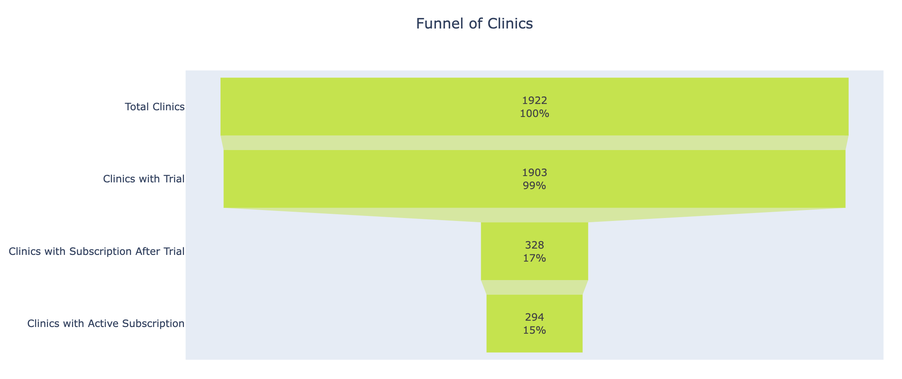
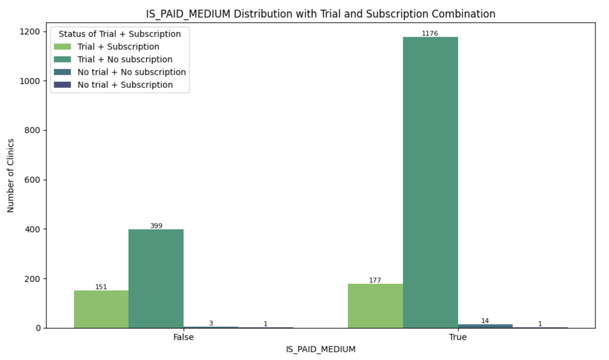
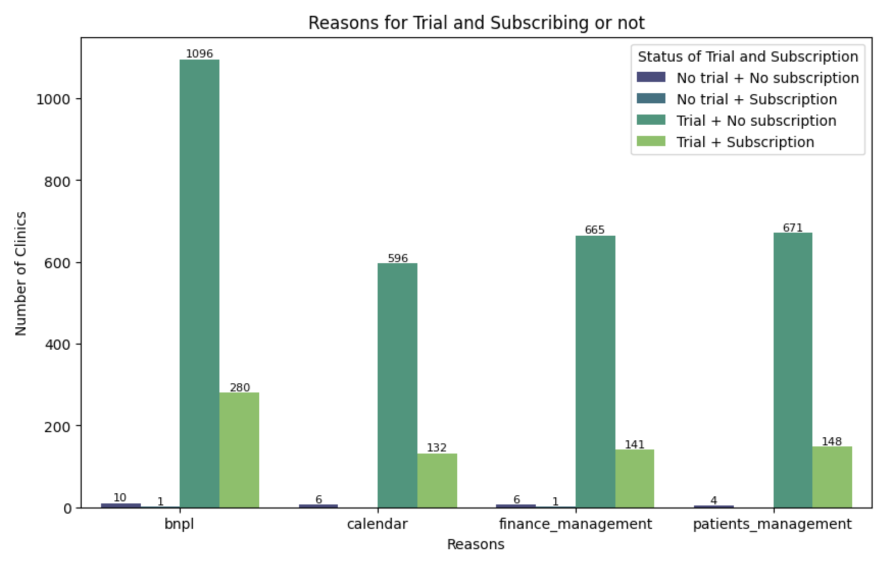

# Capim Case

## 1. Introduction

The focus of the analysis requested was to evaluate the performance of the trial period of the product aimed at dental clinics in order to understand conversion patterns. However, with a duration of 7 days, there is no detailed information on the trial period in the database, which did not make it possible to understand in depth why the trial period did not convert into a subscription.

## 2. Result

### Acquisition funnel

The funnel shows a big drop after the 7-day test period. However, the churn rate for those who have subscribed is 12%.

### Marketing

There is a big break between the trial period and the subscription to the product. This begs the questions: has the marketing targeted the right audience? Is the money earmarked for paid media being well spent?
Among the clinics that subscribed after the 7-day trial period, the results of paid and unpaid media were similar.

### Interests

The main interest of clinics is the buy now pay later (BNPL), but after the test this reason was not enough for the clinic to subscribe.

## 3. Next steps

- **Collecting additional data on the testing period**: it is essential to collect more in-depth data specific to this stage, such as reasons for dropping out, engagement during the test and user feedback.
- **Qualitative analysis of marketing communication**: a possible breach of expectations between the initial promise and the experience during the test deserves a detailed evaluation.
- **Exploit opportunities with the low cancellation rate**: The cancellation rate of only 12% among those who subscribed to the product indicates significant satisfaction after joining - use testimonials from these customers to strengthen communication with new prospects.

## 4. Development of the Solution
  

The analysis was carried out using the following steps:
1. **Data Collection:** csv files provided by the company.

2. **Data Cleaning and Preparation:** 

    * Columns with all NaN lines have been removed.

    * Date variables have had their data types changed.

    * The three tables were joined by the CLINIC_ID key.

    * New variables were created to help analyze the data.

3. **Data exploration**

4. **Interpretation of Results:** The data was analyzed to answer the proposed question.

## Author

## License

