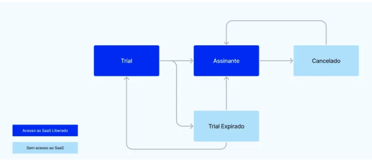
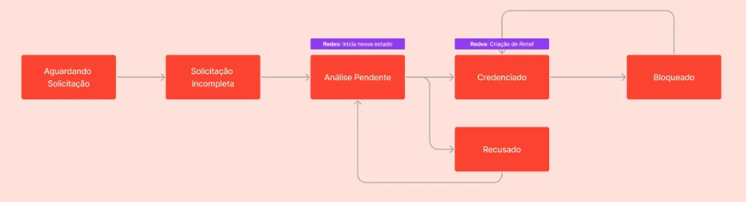

# Test Case - Data Analyst

Dear Candidate, 

This test aims to perform an exploratory data analysis using a real Capim dataset containing information on the acquisition of clinics. The intention is to assess your performance in real work situations and problems that you will frequently encounter in our team.

## Context

Capim builds a working platform (SaaS - *Software as a Service*) focused specifically on dental clinics, where dentists and clinic owners find all the services they need to manage their operations. Our software offers a modern agenda, electronic medical records and patient files, as well as access to financial management and much more!

Our new client acquisition flow works from our [website](https://capim.com.br/), where the user can register directly or ask to speak to a specialist first. Once registered, they have access to a **product trial** (*trial*) period where they can use all our features before signing up. Once his trial period is over, he can only use the product when he subscribes. The focus of this case will be to understand the trial period and how it can be improved.

One of the most popular features of our product, and considered a differentiator, is **Capim Financing**, where Capim finances a patient's treatment at no risk to the clinic, and the patient pays Capim back in up to 36 installments (basically working like a loan). This product is also known internally as *Buy now, pay later* (BNPL).

The accreditation process is a validation of the clinic's identity, which Capim carries out before approving it to use our funding. It is an anti-fraud process that allows us to assess more assertively the risks of carrying out financing for clients of that clinic.

## What needs to be done

Your objective is to bring the main metrics related to the acquisition of clinics to an **exploratory data analysis** with this base, in order to identify bottlenecks and opportunities to optimize the entry of clinics into Capim. 

You will have at your disposal three Capim datasets that represent elements of our transactional information base. You will need to put these models together in the right way in order to analyze the trial period. 

The files include the clinics that registered in the months of **August and September 2023**, and their interactions up to the extraction date (18/10/2023).

The **clinics table** contains information about registered clinics and some of their milestones, such as trials and accreditation. Here it is worth mentioning that Capim has some partnerships with large dental clinic chains and franchises throughout Brazil (differentiated from the others by columns such as business_segmentation and is_chain_clinic . These clinics only use Capim Financing, and should therefore be removed from analyses of subscription conversions.

The **subscriptions table** contains information on clinic subscriptions. A subscription is defined as the beginning of a recurring payment scheme, with a start date, end date (if it has been terminated) and recurring payments. If a clinic starts a subscription, ends it and then becomes a subscriber again, it will have multiple subscription lines. 

The **activity table** records all the activities carried out by the clinic, containing time records of when the clinic performed a particular action. We have different types of activities in the product, which in turn are organized into hierarchical levels to make it easier for us to work with them. These levels are available in the table ( module , analytics_domain , feature ). The activities are also divided into valid and non-valid activities, for the sake of convenience: some metrics are only calculated considering “valid” activities and others are not. This extract contains only activities carried out during the trial period.

## Deliverables

The deliverables of this case are:

1. A **data model** that aggregates information on the clinic's entry and its trial period until eventual conversion. This should be a model that facilitates the construction of *dashboards* for data acquisition and analysis. You can create other intermediate models if you think they would be useful for other analyses and as a way of breaking down the work. **A `.csv` file with the resulting table must be delivered, as well as the code that generated it in SQL, Python, R, etc. 
2. Conducting an Exploratory Data Analysis (EDA), with a brief presentation of your business, including relevant information about the operation, key insights, and optimization opportunities found. The study's audience is Capim's business stakeholders (CEO, Product Managers, Designers, etc.), so it should be in a simple-to-understand format, either a report or a slide show.

## Considerations

- **You can use any tool you like to carry out the analysis**: Excel, Tableau, PowerBI, R, Python, or any other. Only the results will be taken into account, and not necessarily how they were arrived at.
- Not all the information provided in the table needs to be used or will be relevant. **No prior selection has been made of which information is useful and which is not**. So don't feel obliged to go down every path and use every possible number.

- Remember to make sure you have all the project deliverables, and the audience that will interact with it: the data model evaluators will be people from the data team, while the data analysis report will also be evaluated by business stakeholders.

Source: [link](https://capim.notion.site/Test-Case-Data-Analyst-e779cc4a13cc418485636a41bc817a55)